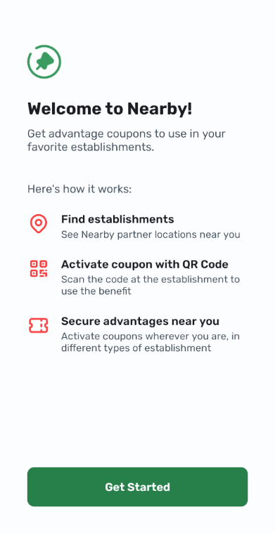
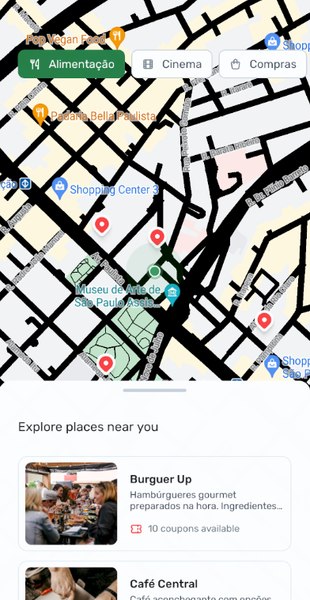
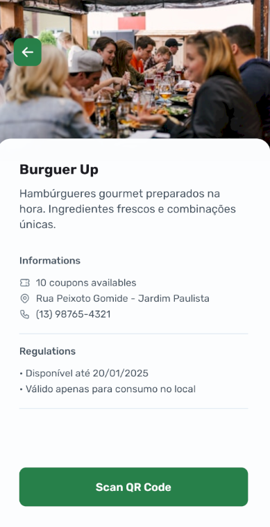

# 📱 Partner Establishments App

This app displays partner establishments offering exclusive promotions and benefits based on the user's location. Developed during the **NLW Pocket Mobile** by [Rocketseat](https://www.rocketseat.com.br/) in 4 classes within the **React Native** track.

<div style="display: flex; justify-content: space-around; gap: 10px;">
  
  
  
</div>

---

## 🚀 Technologies Used

- [React Native](https://reactnative.dev/)
- [Expo](https://expo.dev/)
- [Expo Camera](https://docs.expo.dev/versions/latest/sdk/camera/)
- [React Native Maps](https://github.com/react-native-maps/react-native-maps)
- [TypeScript](https://www.typescriptlang.org/)

---

## 🛠 How to Run the Project

Follow the steps below to run the API and the mobile project on your machine.

### 📡 For the API

```bash
cd api

npm install

npm start
```

### 📱 For the Mobile Project

```bash
cd mobile

npm install

npx expo start
```

---

## 📄 License

This project is licensed under the MIT License. See the [LICENSE](.github/LICENSE) file for more details.

---

Developed by [Marcos Renê](https://www.linkedin.com/in/marcosrene) during the [NLW Pocket Mobile by Rocketseat](https://www.rocketseat.com.br/) ❤️✨.
